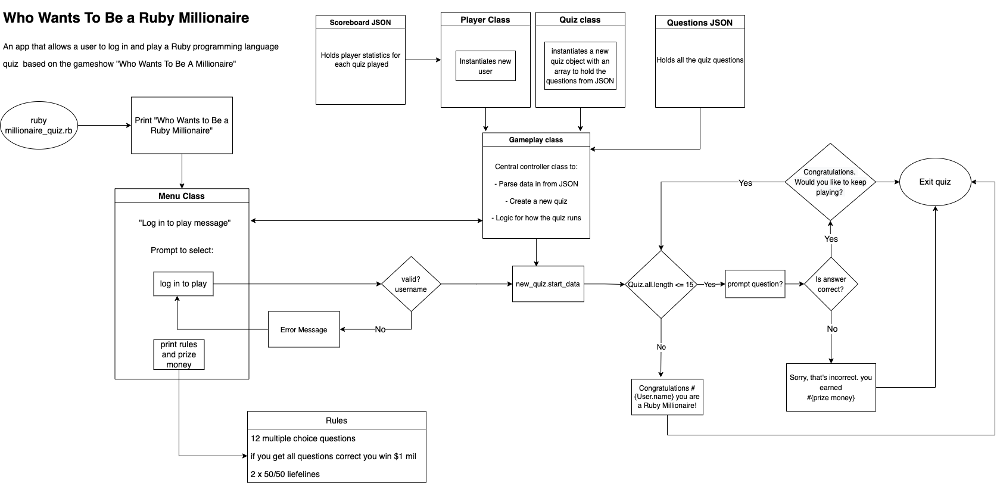

# Who Wants To Be a Ruby Millionaire
## A Terminal Quiz Application Based On The Ruby Programming Language

## Features

### Log In With Valid User Name and Initiate Player 
User prompted to enter a valid user name using Regex and TTY-prompt. Sets variables for instance of Player Class

### View Scoreboard of past attempts in Table
This feature reads and writes to JSON using using methods and instance variables. 
Terminal Table was used to display data. Scoreboard outputs a players username, score, prize money, and how many life lines they have used.

### Quiz 
Quiz questions parsed from JSON and held in an instance of the Questions class. 

### Earn Money as you go 
Each question increases in value as the quiz progresses, player scores and prize money earned are updated in gameplay using methods and control statements.

### Two 50/50 life line opportunities 
A method was used to halve the multiple choice options and present the half containing the correct answer

### Main Menu Feature to present Rules and Prize Money
Prize money and Rules presented using Terminal-Table 

## Implementation and Planning

Planning of the application involved:
- Defining each feature of the app 
- Defining what classes would be used to achieve the features. 
- Defining the behaviours of each class to achieve the desired outcome
- Defining the attributes needed to implement the behaviour of each class and their interactions
- This was then translated to a Trello board for implementation
- Research of potential Ruby gems that would aid in the project

Adding requirements to the Trello board, once features were defined:
- TDD would be implemented with the use of Rspec tests
- Bash Script 
- Command line arguments would be implemented making use of the OptionParser class 
- Source control as a reminder to make regular git commits 
- Updating Dependencies (Ruby gems) to make sure they were achieving their intended purpose for the project

### You can view the planning and implementation on my trello board via the link 
https://trello.com/b/PRylJ433/quizapp

### Trello Board approximately at the half way point

### Trello Board towards the end of the project

### High Level Overview Of The Application

## Install Instructions 
For the app to run you will need the following requirements:
 - Ruby installed on your local machine
 - Ruby Gem dependencies installed

 Ensure gem dependencies are installed and up to date:
- Run bundle install from the src directory 
- If you do not have bundler installed, run the command gem install bundler 

To execute the program: 
- Navigate to the src directory and run ruby ruby_millionaire.rb 
- Alternatively run ./run_app.sh to execute the program  with a bash script 

Executing the program with a trailing command line argument:
- -h or -help will display a help message with information regarding how to play, dependencies, and system requirements
- -q or -quick will skip the main menu and 'quick start' to log in and play

For the best experience expand the command line to the full width of your monitor
