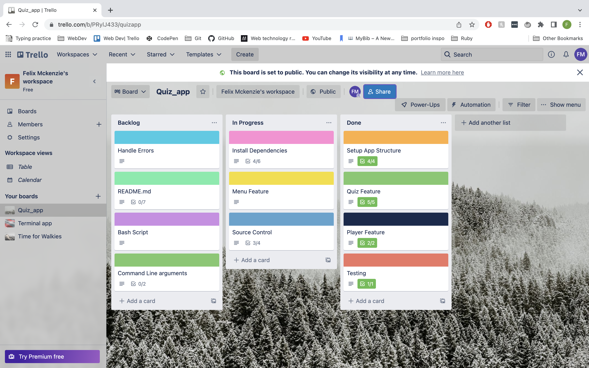
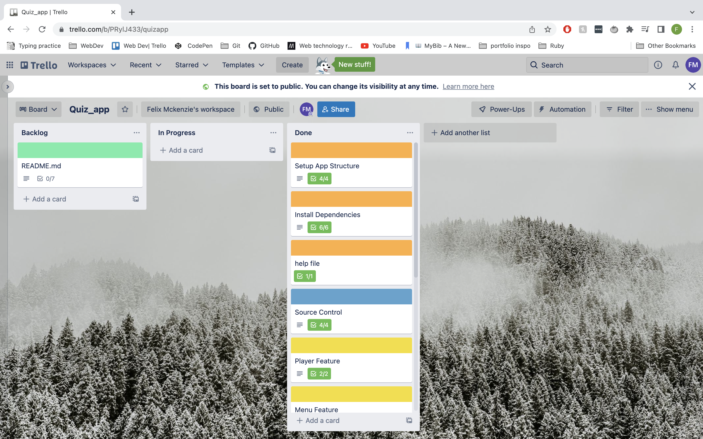
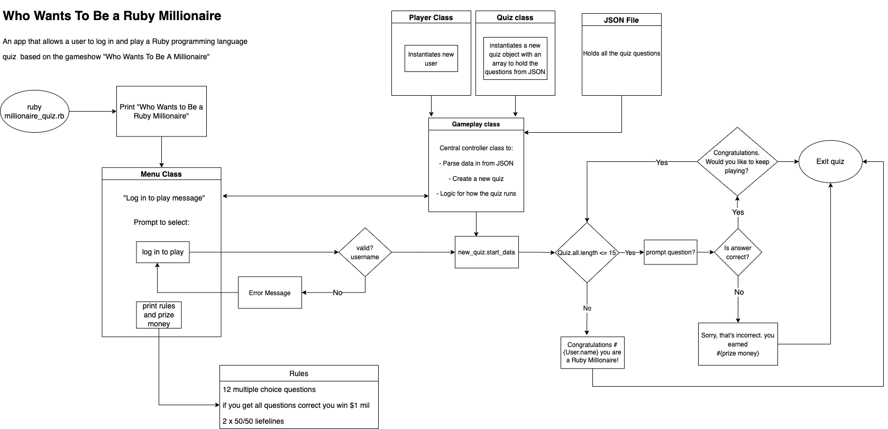

# Who Wants To Be a Ruby Millionaire
## A Terminal Quiz Application 

## Features
screenshots of app plus description of each feature 

- log in with valid user name to play
- 50/50 lifeline feature 
- display prizes via main menu 
- 

## Implementation and Planning
You can view the planning and implementation on my trello board via the link 
https://trello.com/b/PRylJ433/quizapp

### Trello Board approximately at the half way point

### Trello Board towards the end of the project

### High Level Overview Of The Application

## Install Instructions 
For the app to run you will need the following requirements:
 - Ruby installed on your local machine
 - Ruby Gem dependencies installed 

To ensure gem dependencies are installed and up to date
Run bundle install from the main app directory containing the Gemfile 
if you do not have bundler installed run gem install bundler 

To execute the program navigate to the lib directory
Run the command ruby ruby_millionaire.rb 
Alternatively run ./run_app.sh to execute the program  with a bash script 

Executing the program with a trailing command line argument:
-h or -help will display a help message with information regarding how to play, dependencies, and system requirements
-q or -quick will skip the main menu and 'quick start' to log in and play

For the best experience expand the command line to the full width of your monitor
